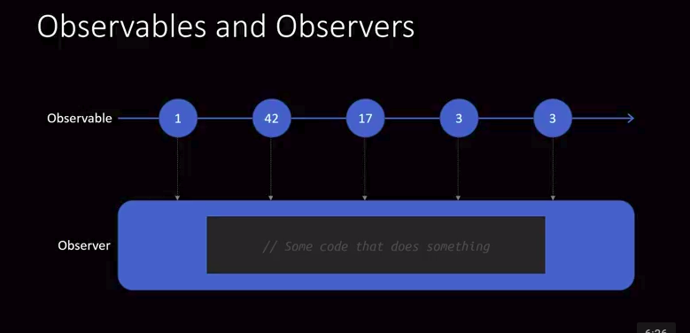

# Learn RxJS

**What is it?**: *An API for asynchronous programing with observable streams.*

1. **Streams**: Are values/events emitted over times 
2. **Observable**: An observable is a function that produces a stream of values to an observer over time. When you subscribe to an observable, you are an *Observer*. An observable can have multiple observers.
3. **Subscriptions**: Observers get converted to a *Subscriber*, in order to provide Subscription-like capabilities such as unsubscribe.
4. **Subject**: A Subject, in contrast to an observable, is simply an observer that's also able to emit values. It's both an observable and an observer simultaneously. This is unlike an observable, as an observer that's subscribed to an observable can only read values emitted from an observable.

[Reference](https://www.youtube.com/watch?v=PhggNGsSQyg)

## Why?

1. Decoupled code
2. Observable Operators

## Operations on simple streams

1. map()
2. filter()
3. reduce()
4. take()
5. so on....